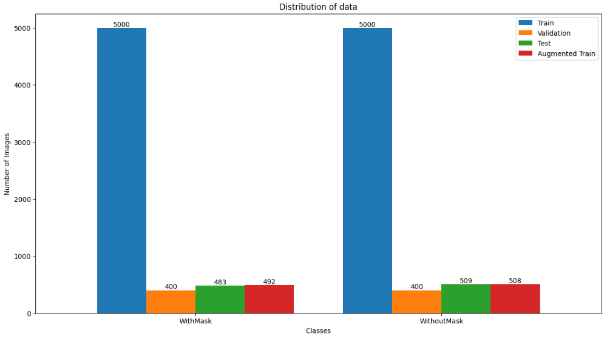
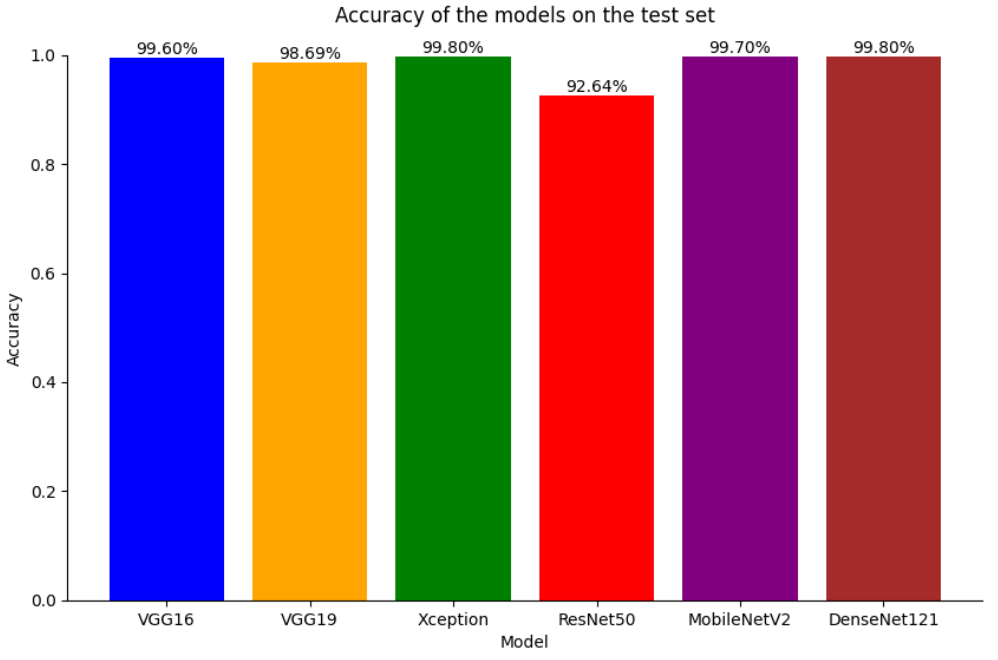

# Face Mask Detection using CNN

## Introduction
Face mask detection is a crucial task in ensuring public health and safety, especially during pandemics like COVID-19. This project aims to develop a convolutional neural network (CNN) model to detect whether a person is wearing a face mask or not. The CNN model is trained on a dataset containing images of people with and without face masks.

## Dataset

The dataset used in this project is the "[Face Mask Dataset](https://www.kaggle.com/datasets/ashishjangra27/face-mask-12k-images-dataset)", which consists of images of individuals wearing and not wearing face masks. The dataset is divided into three subsets: train, validation, and test. Consisting of 11,792 images belonging to 2 classes.

## Data Augmentation

To enhance the diversity of the training dataset and improve the generalization ability of the model, data augmentation techniques are applied. These techniques include:

* Rotation

* Width and height shift

* Shear

* Zoom

* Horizontal flip

After data augmentation, the dataset distribution by label is illustrated in the following chart.

## Experimentation

### Model Training

Several pre-trained CNN architectures are utilized in this project, including VGG16, VGG19, Xception, ResNet50, MobileNetV2, and DenseNet121. Pre-trained models are fine-tuned on the face mask dataset.

### Model Comparison

A comparison is conducted to assess the effectiveness of each model in detecting face masks. The test accuracy and other relevant metrics are analyzed to determine the best-performing model.

The following is the performance chart of the models on the test set.

## Conclusion
In conclusion, this project demonstrates the application of CNN models for face mask detection. By leveraging pre-trained architectures and data augmentation techniques, we achieve promising results in detecting face masks accurately.
